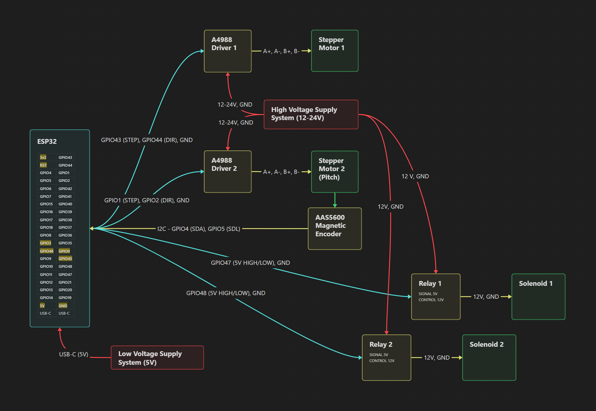

# Stepper-Pneumatic-Turret
Some turret that utilizes a stepper motor for kinematics and pneumatically operated utility.

The required Python libraries are `opencv-python`, `numpy`, and `mediapipe`.

For the ESP32, the Arduino sketch requires `WiFi.h`, `esp_camera.h`, `esp_http_server.h`, and `AccelStepper` from the Arduino IDE.

